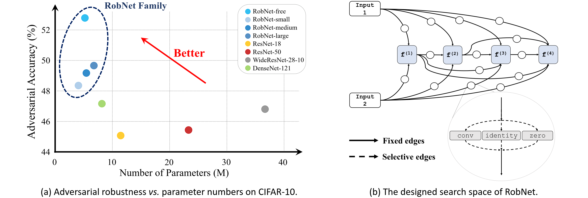

# When NAS Meets Robustness: In Search of Robust Architectures against Adversarial Attacks 
This repository contains the implementation code for paper [When NAS Meets Robustness: In Search of Robust Architectures against Adversarial Attacks](https://arxiv.org/abs/1911.10695) (__CVPR 2020__). Also check out the [project page](http://www.mit.edu/~yuzhe/robnets.html).

In this work, we take an architectural perspective and investigate the patterns of network architectures that are resilient to adversarial attacks. We discover a family of robust architectures (__RobNets__), which exhibit superior robustness performance to other widely used architectures.



## Installation

### Prerequisites
- __Data:__ Download the [CIFAR10](https://www.cs.toronto.edu/~kriz/cifar.html), [SVHN](http://ufldl.stanford.edu/housenumbers/) and [ImageNet](http://image-net.org/download) dataset and move the test/validation set to the folder `data/`.

- __Model:__ Download the [pre-trained models](https://drive.google.com/file/d/1h2JLcumQgS296Su950ZEtiJrEgxWzxfP/view?usp=sharing) and unzip to the folder `checkpoint/`.


### Dependencies for RobNets 
You can install the dependencies for RobNets using
```bash
pip install -r requirements.txt
```


## Experiments

### Test

All the configurations of the experiments are provided in folders `experiments/*/config.py`, including different datasets and RobNet architectures. You can directly modify them to suit your demand.

To conduct a specific experiment, e.g. `RobNet_free` for CIFAR10, run
```bash
python main.py --config='./experiments/RobNet_free_cifar10/config.py' --eval_only
```
With the flag `eval_only`, you can test the results for all the experiments in `experiments`.

### Train (NEW)

We also provide the training interface of RobNets. For now, only training on CIFAR10 is provided. Training on ImageNet is WIP. 

We use [Pytorch distributed training](https://pytorch.org/tutorials/intermediate/ddp_tutorial.html) with [slurm](https://slurm.schedmd.com/tutorials.html) and [nccl](https://docs.nvidia.com/deeplearning/nccl/user-guide/docs/overview.html) backend. You can conduct the training for `RobNet_large` on CIFAR10 by running
```bash
GPUS_PER_NODE=8 GPUS=32 bash slurm_train.sh **PartitionName** './experiments/RobNet_large_cifar10/config.py'
```

`RobNet_free_cifar10` and `RobNet_large_v1_cifar10` in `checkpoint/` are obtained with a total training batch size `1536`, while `RobNet_large_v2_cifar10` with batch size `1024`. Make sure to linearly scale the learning rate if you have a different batch size. (In fact, the hyper-parameters here are not optimized sufficiently by trial and error. If you find a better combination, welcome to deliver PR!)

Note: You may notice that some of the training configurations are slightly different from the original paper, such as the learning rate scheduler. However, the training configurations in this repo can yeild even better results than those in the paper. Check the training log of `RobNet_large_v1_cifar10` [here](https://drive.google.com/file/d/11S1F2-B4Lm5Sc7uFBE4bh8-QItwE2Stf/view?usp=sharing) using the script in this repo. You can try a test using this checkpoint and will get ~83.5% clean accuracy and ~52.1% adversarial accuracy under PGD-20 attack!

## Use RobNet Architectures
To use the searched RobNet models, for example, load `RobNet_free` on CIFAR10:
```python
import models
import architecture_code
import utils

# use RobNet architecture
net = models.robnet(architecture_code.robnet_free)
net = net.cuda()
# load pre-trained model
utils.load_state('./checkpoint/RobNet_free_cifar10.pth.tar', net)
```
For other models, the loading process is similar, just copy the corresponding parameters (you can find in the variable `model_param` in each `experiments/*/config.py`) to the function `models.robnet()`.


## Acknowledgements
The implementation of RobNets is partly based on [this work](https://github.com/quark0/darts).


## Citation
If you find the idea or code useful for your research, please cite [our paper](https://arxiv.org/abs/1911.10695):
```bib
@article{guo2019meets,
  title={When NAS Meets Robustness: In Search of Robust Architectures against Adversarial Attacks},
  author={Guo, Minghao and Yang, Yuzhe and Xu, Rui and Liu, Ziwei and Lin, Dahua},
  journal={arXiv preprint arXiv:1911.10695},
  year={2019}
}
```


## Contact
Please contact guomh2014@gmail.com and yuzheyangpku@gmail.com if you have any questions. Enjoy!
